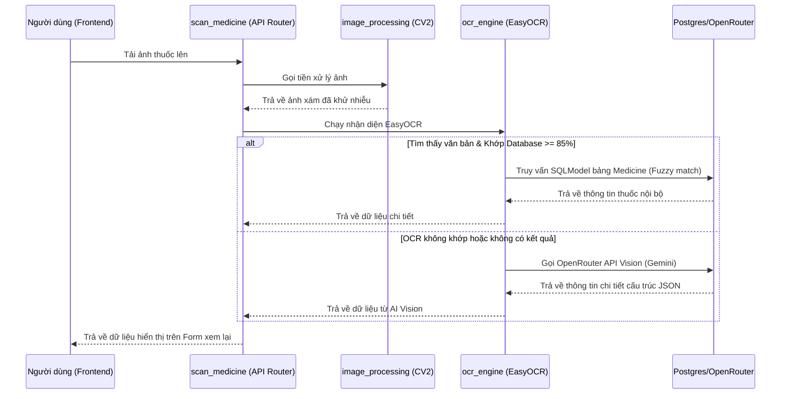

# Báo Cáo Tổng Hợp Dự Án: Tủ Thuốc Gia Đình Thông Minh (AMA Ultimate System)

Tài liệu này cung cấp cái nhìn toàn diện về cấu trúc thư mục, chức năng của từng file, kiến trúc hệ thống, và các luồng nghiệp vụ chính của dự án nhằm giúp AI Agent mới có thể dễ dàng hiểu, vận hành và phát triển dự án.

---

## 1. Tổng Quan Dự Án

**AMA Ultimate System** là một ứng dụng quản lý tủ thuốc gia đình thông minh kết hợp trí tuệ nhân tạo (AI). Dự án cung cấp các tính năng chính:
- **Quét nhận diện thuốc (OCR & AI Vision)**: Cho phép chụp ảnh bao bì thuốc, nhận diện thông tin thuốc nội bộ bằng OCR local (EasyOCR kết hợp Fuzzy matching) hoặc trích xuất thông tin tự động bằng mô hình AI Vision (Gemini 2.5 Flash thông qua OpenRouter) nếu là thuốc mới.
- **Trợ lý y tế ảo (AI Chatbot & RAG)**: Tư vấn sử dụng thuốc an toàn, kiểm tra chống chỉ định cho đối tượng nhạy cảm (bà bầu, trẻ em, người suy gan/thận), sử dụng kỹ thuật tìm kiếm kết hợp (Hybrid Retrieval - Keyword & Semantic Search qua Qdrant).
- **Quản lý tủ thuốc gia đình (Inventory)**: Theo dõi số lượng tồn kho, cảnh báo thuốc sắp hết hạn hoặc sắp hết theo ngưỡng quy định.

---

## 2. Kiến Trúc Hệ Thống

Hệ thống được thiết kế theo mô hình **Client-Server** chạy container hóa với Docker:
- **Frontend**: React (TypeScript), Vite, Zustand (State Management), TailwindCSS, Framer Motion. Thiết kế giả lập giao diện di động (Mobile viewport max-width 480px) trực quan, hiện đại.
- **Backend**: FastAPI (Python), SQLModel (ORM cho PostgreSQL), Qdrant Client (kết nối Vector Database phục vụ RAG).
- **Databases**:
  - **PostgreSQL**: Lưu trữ cơ sở dữ liệu quan hệ (Người dùng, thông tin chi tiết thuốc, lịch sử tiêu thụ thuốc).
  - **Qdrant Cloud/Local**: Cơ sở dữ liệu Vector lưu trữ thông tin nhúng (embeddings) của thuốc phục vụ tìm kiếm ngữ nghĩa.

---

## 3. Cấu Trúc Thư Mục & Chi Tiết Từng File

### 3.1. Các File Cấu Hình Hệ Thống (Root)

- [docker-compose.yml](file:///e:/code/ama-projectteam/docker-compose.yml): Cấu hình Docker để khởi chạy 4 service chính:
  - `db`: Postgres 16-alpine (Cổng `5433` ánh xạ ra ngoài để tránh tranh chấp cổng mặc định `5432` trên Windows).
  - `qdrant`: Qdrant Vector database (Cổng `6333` và `6334`).
  - `backend`: FastAPI Python server (Cổng `8000`).
  - `frontend`: Vite React app (Cổng `3000`).
- [.env](file:///e:/code/ama-projectteam/.env): Chứa các biến môi trường cấu hình kết nối Database, Qdrant Cloud API Key, OpenRouter API Key và tên các mô hình AI.
- [.env.example](file:///e:/code/ama-projectteam/.env.example): File mẫu hướng dẫn điền thông tin môi trường.
- [.gitignore](file:///e:/code/ama-projectteam/.gitignore): Danh sách các file và thư mục bỏ qua không đẩy lên Git.

---

### 3.2. Cấu Trúc Backend (`backend/`)

Thư mục backend chứa toàn bộ logic xử lý API, OCR, RAG và kết nối cơ sở dữ liệu.

#### Các file chính tại root backend:
- [Dockerfile](file:///e:/code/ama-projectteam/backend/Dockerfile): Khởi tạo môi trường chạy Backend (Python 3.12). Đặc biệt, tải sẵn mô hình EasyOCR tiếng Việt/Anh và mô hình embeddings (`paraphrase-multilingual-MiniLM-L12-v2`) ngay lúc build để tối ưu thời gian khởi động container.
- [requirements.txt](file:///e:/code/ama-projectteam/backend/requirements.txt): Định nghĩa toàn bộ các gói thư viện Python cần dùng (FastAPI, SQLModel, EasyOCR, Langchain, Qdrant, RapidFuzz...).
- [main.py](file:///e:/code/ama-projectteam/backend/main.py): File khởi chạy chính của ứng dụng FastAPI. Có nhiệm vụ:
  - Cấu hình CORS cho Frontend (`http://localhost:3000`).
  - Mount thư mục `static/` phục vụ các tệp tĩnh (ảnh chụp, tài liệu thuốc).
  - Khởi tạo và liên kết các Router API (`auth`, `scan`, `chat`, `inventory`).
- [ingest_rag.py](file:///e:/code/ama-projectteam/backend/ingest_rag.py): Script chạy độc lập để nạp dữ liệu từ file [medicine_samples.json](file:///e:/code/ama-projectteam/backend/config/medicine_samples.json) lên Qdrant Cloud. Sử dụng `HuggingFaceEmbeddings` để mã hóa thông tin chỉ định, cách dùng, chống chỉ định của thuốc thành vector.

#### Thư mục con trong backend:

##### `backend/config/`
- [medicine_samples.json](file:///e:/code/ama-projectteam/backend/config/medicine_samples.json): Tệp JSON chứa bộ dữ liệu mẫu gồm hàng chục loại thuốc với đầy đủ thông tin: tên thương hiệu, tên gốc, phân loại, hàm lượng, chỉ định, chống chỉ định, tác dụng phụ, cách dùng, bảo quản, từ khóa tìm kiếm và đường dẫn ảnh.

##### `backend/core/`
- [database.py](file:///e:/code/ama-projectteam/backend/core/database.py): Thiết lập kết nối PostgreSQL thông qua [create_engine](file:///e:/code/ama-projectteam/backend/core/database.py#L11) và kết nối Qdrant Vector DB bằng [QdrantClient](file:///e:/code/ama-projectteam/backend/core/database.py#L24).

##### `backend/models/`
Định nghĩa các bảng cơ sở dữ liệu bằng SQLModel (kết hợp SQLAlchemy và Pydantic):
- [user.py](file:///e:/code/ama-projectteam/backend/models/user.py): Định nghĩa lớp [User](file:///e:/code/ama-projectteam/backend/models/user.py#L4) đại diện cho bảng người dùng hệ thống.
- [medicine.py](file:///e:/code/ama-projectteam/backend/models/medicine.py): Định nghĩa lớp [Medicine](file:///e:/code/ama-projectteam/backend/models/medicine.py#L4) lưu trữ thông tin chi tiết của từng loại thuốc.
- [history.py](file:///e:/code/ama-projectteam/backend/models/history.py): Định nghĩa lớp [ConsumptionHistory](file:///e:/code/ama-projectteam/backend/models/history.py#L4) ghi lại nhật ký sử dụng thuốc của người dùng.

##### `backend/services/`
- [image_processing.py](file:///e:/code/ama-projectteam/backend/services/image_processing.py): Chứa hàm [preprocess_for_ocr](file:///e:/code/ama-projectteam/backend/services/image_processing.py#L4) sử dụng OpenCV (`cv2`) để tiền xử lý ảnh chụp (chuyển xám, nâng tương phản CLAHE, lọc nhiễu) giúp EasyOCR nhận diện ký tự tốt hơn.
- [ocr_engine.py](file:///e:/code/ama-projectteam/backend/services/ocr_engine.py): Đảm nhận nhiệm vụ nhận diện văn bản trên ảnh thuốc.
  - Sử dụng hàm [get_reader](file:///e:/code/ama-projectteam/backend/services/ocr_engine.py#L21) để khởi tạo EasyOCR.
  - Hàm [process_medicine_ocr](file:///e:/code/ama-projectteam/backend/services/ocr_engine.py#L89) thực hiện nhận diện văn bản và khớp nối với cơ sở dữ liệu Postgres bằng thuật toán so khớp mờ `rapidfuzz` (so trùng tên thuốc hoặc từ khóa `search_keywords`).
  - Nếu độ tin cậy trùng khớp >= 85%, trả về thuốc trong DB.
  - Nếu không khớp, gọi hàm [call_openrouter_vision](file:///e:/code/ama-projectteam/backend/services/ocr_engine.py#L34) để gửi ảnh qua API OpenRouter Vision (mô hình Gemini) để phân tích toàn bộ thông tin thuốc từ ảnh bao bì và trả về JSON tiếng Việt.

##### `backend/ai_logic/`
- [gemini_service.py](file:///e:/code/ama-projectteam/backend/ai_logic/gemini_service.py): Chứa lớp [GeminiService](file:///e:/code/ama-projectteam/backend/ai_logic/gemini_service.py#L8) kết nối tới API OpenRouter để sinh phản hồi từ mô hình `google/gemini-2.5-flash-lite`.
- [rag_handler.py](file:///e:/code/ama-projectteam/backend/ai_logic/rag_handler.py): Triển khai lớp [RAGHandler](file:///e:/code/ama-projectteam/backend/ai_logic/rag_handler.py#L10) thực hiện tìm kiếm thông tin thuốc (Hybrid Retrieval):
  - **Lớp 1**: So khớp từ khóa cứng bằng Synonym Mapping (từ triệu chứng như "đau đầu", "ỉa chảy" sang các từ khóa tương tự) trên tệp JSON thuốc để lấy kết quả nhanh.
  - **Lớp 2**: Tìm kiếm tương đồng ngữ nghĩa (Semantic search) trên Qdrant thông qua `LangChain` nếu kết quả lớp 1 chưa đủ số lượng yêu cầu.

##### `backend/api/`
Các endpoint router phục vụ yêu cầu từ phía Client:
- [auth.py](file:///e:/code/ama-projectteam/backend/api/auth.py): Endpoint `/api/auth/demo-user` trả về thông tin người dùng thử nghiệm cố định.
- [scan.py](file:///e:/code/ama-projectteam/backend/api/scan.py): Nhận tệp tin ảnh tải lên từ Client, gọi xử lý ảnh và trả về thông tin thuốc nhận diện được. Sau đó, dọn dẹp các tệp ảnh tạm thời trên đĩa.
- [inventory.py](file:///e:/code/ama-projectteam/backend/api/inventory.py): Quản lý kho thuốc ảo. Cung cấp API xem danh sách kho thuốc và trừ số lượng thuốc sử dụng (`/consume`), kiểm tra và cảnh báo khi số lượng vượt ngưỡng tối thiểu.
- [chat.py](file:///e:/code/ama-projectteam/backend/api/chat.py): Endpoint xử lý chatbot `/api/chat`. Lấy thông tin ngữ cảnh từ RAG, lập System Prompt có ràng buộc nghiêm ngặt về an toàn y tế (cảnh báo cao độ cho bà bầu, trẻ em, suy gan/thận), gửi tới Gemini, và thực hiện lọc các ảnh thuốc trả về (loại bỏ ảnh của các loại thuốc được khuyến nghị chống chỉ định trong nội dung câu trả lời).

##### `backend/scripts/`
- [setup_db.py](file:///e:/code/ama-projectteam/backend/scripts/setup_db.py): Chạy khởi tạo schema cơ sở dữ liệu quan hệ Postgres và nạp dữ liệu ban đầu (seed) từ tệp `medicine_samples.json`.

---

### 3.3. Cấu Trúc Frontend (`frontend/`)

Thư mục frontend được tối ưu hóa cho giao diện Web mô phỏng Mobile App.

#### Các file chính tại root frontend:
- [Dockerfile](file:///e:/code/ama-projectteam/frontend/Dockerfile): Đóng gói ứng dụng React/Vite trên môi trường Node.js.
- [package.json](file:///e:/code/ama-projectteam/frontend/package.json): Khai báo các thư viện phụ thuộc: React 18, TailwindCSS, Zustand, Lucide React, Axios, Framer Motion.
- [vite.config.ts](file:///e:/code/ama-projectteam/frontend/vite.config.ts): Tệp cấu hình Vite cho React và TypeScript.
- [tailwind.config.js](file:///e:/code/ama-projectteam/frontend/tailwind.config.js): Cấu hình TailwindCSS.
- [index.html](file:///e:/code/ama-projectteam/frontend/index.html): Trang HTML gốc.

#### Thư mục `frontend/src/`:
- [main.tsx](file:///e:/code/ama-projectteam/frontend/src/main.tsx): Điểm khởi đầu của ứng dụng React, gắn component App vào cây DOM.
- [index.css](file:///e:/code/ama-projectteam/frontend/src/index.css): Nơi nhập các styles của TailwindCSS.
- [App.tsx](file:///e:/code/ama-projectteam/frontend/src/App.tsx): Trọng tâm điều hướng và bố cục của ứng dụng.
  - Quản lý chế độ sáng/tối (Dark Mode).
  - Quản lý trạng thái tab hiện tại (`home`, `cabinet`, `camera`, `ai`) thông qua thanh menu sidebar trượt mượt mà.
  - Component [HomeDashboard](file:///e:/code/ama-projectteam/frontend/src/App.tsx#L18) đóng vai trò màn hình chính hiển thị các phím tắt nhanh tới 3 tính năng của ứng dụng.

#### Thư mục `frontend/src/store/`:
- [medicineStore.ts](file:///e:/code/ama-projectteam/frontend/src/store/medicineStore.ts): Sử dụng Zustand để quản lý kho dữ liệu thuốc hiển thị tại màn hình tủ thuốc ở phía client. Hỗ trợ hàm `addMedicine` để thêm một loại thuốc mới vào danh sách.

#### Thư mục `frontend/src/components/`:
- [CameraScanner.tsx](file:///e:/code/ama-projectteam/frontend/src/components/CameraScanner.tsx): Giao diện quét ảnh thuốc.
  - Hỗ trợ chụp giả lập 4 góc của hộp thuốc hoặc tải ảnh lên thực tế qua cổng Input File.
  - Gửi ảnh tới Backend xử lý và nhận lại thông tin thuốc đã phân tích.
  - Cung cấp form cho phép người dùng xem lại thông tin (đã mở khóa chỉnh sửa tên, hàm lượng, phân loại) và xác nhận thêm vào tủ thuốc.
- [ChatbotAI.tsx](file:///e:/code/ama-projectteam/frontend/src/components/ChatbotAI.tsx): Giao diện trò chuyện y tế với trợ lý ảo.
  - Hiển thị cảnh báo y tế nổi bật ở trên cùng.
  - Hiển thị tin nhắn dạng bong bóng trò chuyện. Hỗ trợ hiển thị thẻ hình ảnh của các loại thuốc được tìm thấy từ RAG.
  - Gửi tin nhắn đến API backend và duy trì lịch sử trò chuyện ngắn.
- [MedicineCabinet.tsx](file:///e:/code/ama-projectteam/frontend/src/components/MedicineCabinet.tsx): Giao diện tủ thuốc gia đình.
  - Hiển thị danh sách các thuốc đang có kèm theo thông tin chi tiết (Phân loại, số lượng, lịch uống).
  - Hỗ trợ thanh tìm kiếm thời gian thực theo tên hoặc phân loại.
  - Tích hợp modal thêm thuốc thủ công bằng cách nhập trực tiếp thông tin.

---

## 4. Luồng Xử Lý Nghiệp Vụ Chính

### 4.1. Luồng Nhận Diện Thuốc Bằng OCR & Cloud Vision


### 4.2. Luồng Tư Vấn Y Tế Thông Qua Chatbot RAG
1. **Người dùng** gửi câu hỏi liên quan tới triệu chứng (Ví dụ: *"Tôi bị đau đầu, tôi nên uống thuốc gì?"*).
2. **FastAPI Router** nhận câu hỏi và chuyển qua `rag_handler`.
3. `rag_handler` thực hiện tìm kiếm kết hợp:
   - Trước tiên, phân tích từ khóa triệu chứng khớp với danh mục Synonym định nghĩa sẵn để lọc nhanh các thuốc thích hợp trong tệp [medicine_samples.json](file:///e:/code/ama-projectteam/backend/config/medicine_samples.json).
   - Nếu chưa đạt đủ 6 kết quả, thực hiện truy vấn Vector Search trên Qdrant bằng văn bản câu hỏi ban đầu để tìm các đoạn tài liệu có liên nghĩa.
4. Tổng hợp các thông tin thuốc tìm thấy thành khối ngữ cảnh (`context`).
5. Kết hợp `context` cùng câu hỏi gốc vào cấu trúc **System Prompt** với các ràng buộc về an toàn (nếu phát hiện có thai, trẻ em thì phải đưa cảnh báo khẩn lên đầu, sắp xếp thứ tự thuốc ưu tiên an toàn, bổ sung tuyên bố từ chối trách nhiệm y tế).
6. Gửi dữ liệu qua **OpenRouter** tới mô hình `Gemini 2.5 Flash-lite`.
7. Nhận văn bản trả lời, thực hiện bộ lọc Regex câu để loại bỏ các ảnh của các loại thuốc được khuyến nghị chống chỉ định (ví dụ: nếu AI khuyên *"Không dùng Decolgen cho bà bầu"*, ảnh Decolgen sẽ bị loại khỏi danh sách ảnh đính kèm).
8. Trả về cho Frontend hiển thị tin nhắn kèm hình ảnh trực quan.

---

## 5. Hướng Dẫn Vận Hành Dự Án

### 5.1. Khởi chạy bằng Docker Compose (Khuyến nghị)
1. Đảm bảo bạn đã sao chép và cấu hình đầy đủ các biến môi trường trong file `.env`.
2. Khởi chạy toàn bộ hệ thống bằng lệnh:
   ```bash
   docker-compose up --build -d
   ```
3. Sau khi các container đã trực tuyến:
   - Backend sẽ chạy tại: `http://localhost:8000`
   - Frontend sẽ chạy tại: `http://localhost:3000`

### 5.2. Khởi tạo dữ liệu ban đầu (Database & RAG Embeddings)
- **Nạp dữ liệu Postgres**:
  Chạy container backend và thực hiện script khởi tạo:
  ```bash
  docker exec -it ama_backend python scripts/setup_db.py
  ```
- **Nhúng dữ liệu Vector RAG lên Qdrant**:
  Chạy script để nhúng dữ liệu từ JSON lên Qdrant Cloud:
  ```bash
  docker exec -it ama_backend python ingest_rag.py
  ```

Tài liệu này đóng vai trò là kiến thức cốt lõi giúp các AI Agent định hình nhanh toàn cảnh dự án trước khi thực hiện viết code hoặc sửa đổi cấu trúc.
